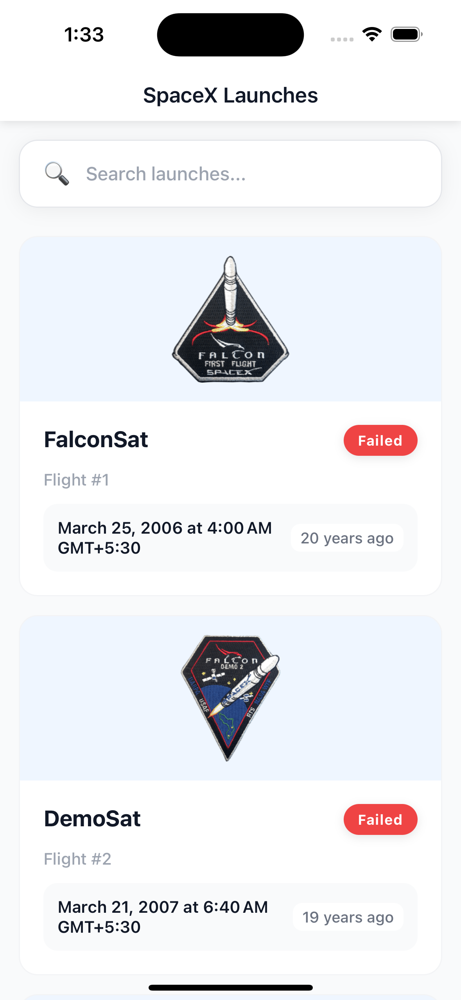
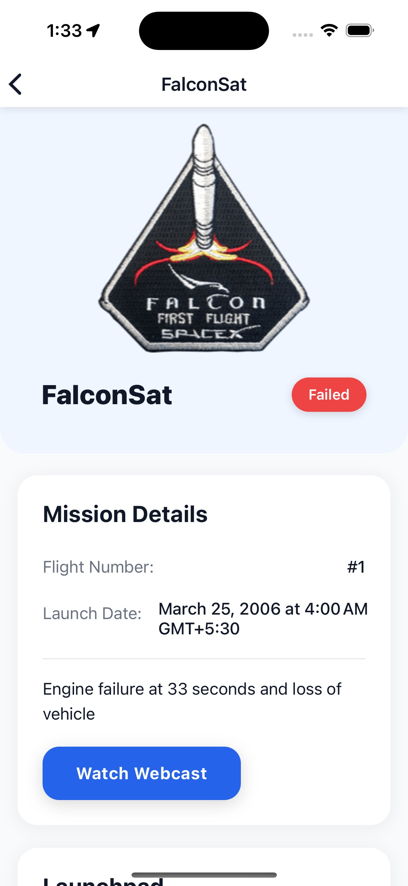
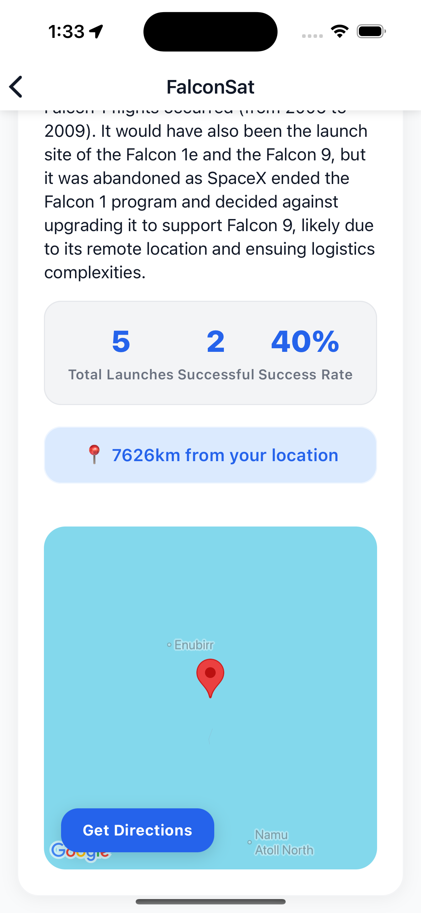
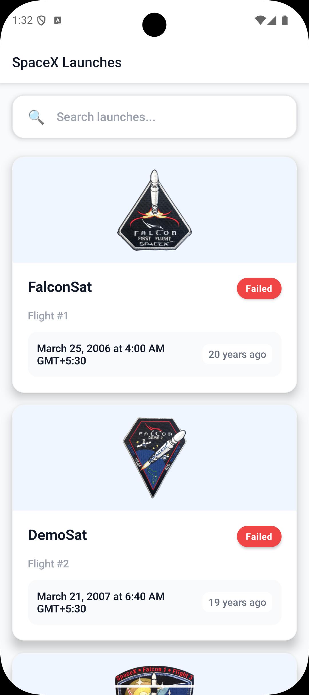
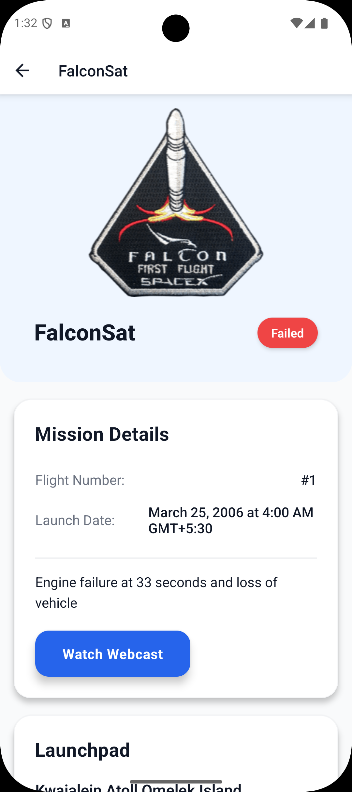
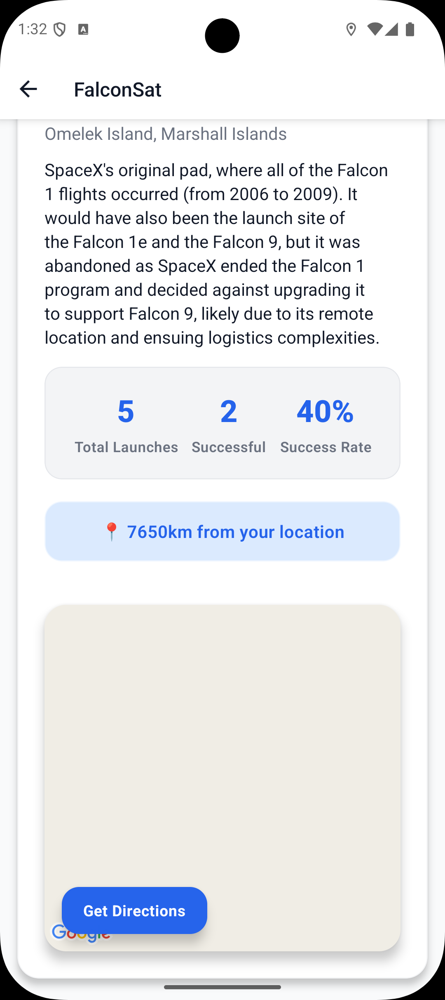

# 🚀 Tripare – SpaceX Launch Explorer

A production-ready mobile app built with React Native and Expo SDK 53 that provides a maps-first experience for exploring SpaceX launches and launchpads.

## 📱 Features

- **Launches List**: Browse all SpaceX launches with infinite scroll and pull-to-refresh
- **Search Functionality**: Client-side search by mission name
- **Launch Details**: Comprehensive mission information with status indicators
- **Interactive Maps**: View launchpad locations with user location integration
- **Native Navigation**: One-tap directions to launchpads via native Maps apps
- **Location Services**: Real-time distance calculation between user and launchpad
- **Modern UI**: Clean, consistent design with proper loading/error/empty states

## 🛠️ Tech Stack

- **Framework**: React Native with Expo SDK 53 (Managed Workflow)
- **Language**: TypeScript
- **Navigation**: React Navigation 6
- **Maps**: React Native Maps (Google Maps for Android, Apple Maps for iOS)
- **Location**: Expo Location for permissions and geolocation
- **API**: SpaceX REST API v4/v5
- **Code Quality**: ESLint + Prettier + TypeScript strict mode

## 🚀 Quick Start

### Prerequisites

- Node.js (16 or later)
- Expo CLI (`npm install -g @expo/cli`)
- Expo Go app on your mobile device OR
- iOS Simulator / Android Emulator

### Installation

1. **Clone the repository**
   ```bash
   git clone <repository-url>
   cd tripare-spacex
   ```

2. **Install dependencies**
   ```bash
   npm install
   ```

3. **Start the development server**
   ```bash
   npx expo start
   ```

4. **Run on device**
   - Scan the QR code with Expo Go (Android) or Camera app (iOS)
   - Or press `i` for iOS simulator / `a` for Android emulator

## 📍 Maps Implementation

### Libraries Used

- **react-native-maps** (v1.10.0): Core map functionality
- **expo-location** (v18.0.0): Location permissions and GPS access
- **expo-linking** (v7.0.0): Deep linking to native Maps apps

### Features

- **Launchpad Markers**: Red pins showing exact launchpad locations
- **User Location**: Blue dot showing current user position (with permission)
- **Distance Calculation**: Haversine formula for accurate distance measurement
- **Native Maps Integration**: Platform-specific deep linking
  - iOS: Apple Maps (`maps.apple.com`)
  - Android: Google Maps (`maps.google.com`)

### Permission Handling

The app implements a comprehensive location permission flow:

1. **Check Permission Status**: On app launch and screen focus
2. **Request Permission**: User-friendly prompts with clear messaging
3. **Handle Denied State**: Graceful fallback without breaking functionality
4. **Manual Retry**: Allow users to re-request permissions

```typescript
// Permission flow example
const result = await LocationService.getCurrentLocation();
if (result.status === LocationPermissionStatus.GRANTED) {
  setUserLocation(result.location);
} else {
  // Show fallback UI
}
```

## 🏗️ Project Structure

```
src/
├── components/          # Reusable UI components
│   ├── ErrorBoundary.tsx
│   ├── LoadingState.tsx
│   ├── EmptyState.tsx
│   ├── ErrorState.tsx
│   └── LaunchCard.tsx
├── navigation/          # Navigation setup
│   ├── RootNavigator.tsx
│   └── types.ts
├── screens/             # Screen components
│   ├── LaunchesListScreen.tsx
│   └── LaunchDetailsScreen.tsx
├── services/            # API and external services
│   ├── spacexApi.ts
│   ├── locationService.ts
│   └── navigationService.ts
├── types/               # TypeScript type definitions
│   └── spacex.ts
└── utils/               # Helper functions
    ├── distance.ts
    ├── dateHelpers.ts
    └── launchHelpers.ts
```

## 🔧 API Integration

### SpaceX API Endpoints

- **Launches**: `https://api.spacexdata.com/v5/launches`
- **Launchpads**: `https://api.spacexdata.com/v4/launchpads/:id`
- **Search**: `https://api.spacexdata.com/v5/launches/query`

### Error Handling

Robust error handling with user-friendly messages:

```typescript
export class SpaceXApiError extends Error {
  constructor(message: string, public status?: number) {
    super(message);
    this.name = 'SpaceXApiError';
  }
}
```

## 🎨 UI/UX Design

### Design Principles

- **Clean & Modern**: Light theme with subtle shadows and rounded corners
- **Consistent Typography**: Clear hierarchy with proper font weights
- **Touch-Friendly**: Adequate touch targets (44pt minimum)
- **Loading States**: Skeleton screens and spinners for better perceived performance
- **Error Recovery**: Clear error messages with retry actions

### Color Palette

- **Primary Blue**: `#007AFF` (iOS system blue)
- **Success Green**: `#34C759`
- **Error Red**: `#FF3B30`
- **Warning Orange**: `#FF9500`
- **Gray Text**: `#8E8E93`
- **Background**: `#F2F2F7`

## ⚡ Performance Optimizations

### FlatList Optimizations

- **`React.memo`**: Memoized list items to prevent unnecessary re-renders
- **`useCallback`**: Memoized event handlers
- **`keyExtractor`**: Efficient key extraction for list items
- **`removeClippedSubviews`**: Memory optimization for large lists
- **`maxToRenderPerBatch`**: Controlled rendering batch size
- **`windowSize`**: Optimized render window

### Memory Management

- **Image Caching**: Automatic image caching via React Native Image
- **API Response Caching**: Intelligent data fetching to minimize API calls
- **Component Unmounting**: Proper cleanup of timers and subscriptions

## 🧪 Error Handling

### ErrorBoundary

Global error boundary catches and displays runtime errors:

```typescript
<ErrorBoundary>
  <RootNavigator />
</ErrorBoundary>
```

### API Error Handling

- Network timeouts and retries
- HTTP status code handling
- User-friendly error messages
- Offline state detection

### Location Error Handling

- Permission denied graceful fallback
- GPS unavailable scenarios
- Location timeout handling

## 📱 Screenshots

### iOS Screenshots

<div align="center">

#### Launches List Screen


*Browse all SpaceX launches with search functionality and mission patches*

#### Launch Details Screen  


*Detailed mission information with status indicators and mission patches*

#### Interactive Map


*Launchpad location with distance calculation and native Maps integration*

</div>

### Android Screenshots

<div align="center">

#### Launches List Screen


*Clean list layout with infinite scroll and pull-to-refresh functionality*

#### Launch Details Screen


#### Interactive Map


*Comprehensive mission details with launch statistics and success rates*

</div>

### Key Features Shown
- **Clean Design**: Modern UI with consistent typography and spacing
- **Mission Patches**: Official SpaceX mission badges for each launch
- **Status Indicators**: Color-coded badges (Success/Failed/Upcoming)  
- **Search Functionality**: Real-time filtering by mission name
- **Interactive Maps**: Precise launchpad locations with user distance
- **Native Integration**: One-tap directions to device's Maps app
- **Launch Statistics**: Success rates and historical data

## 🔐 Permissions

### iOS (Info.plist)
```xml
<key>NSLocationWhenInUseUsageDescription</key>
<string>This app needs location access to show your distance to SpaceX launchpads.</string>
```

### Android (app.json)
```json
{
  "expo": {
    "android": {
      "permissions": [
        "ACCESS_COARSE_LOCATION",
        "ACCESS_FINE_LOCATION"
      ]
    }
  }
}
```

## 🚀 Deployment

### Building for Production

1. **EAS Build Setup**
   ```bash
   npm install -g @expo/eas-cli
   eas build:configure
   ```

2. **iOS Build**
   ```bash
   eas build --platform ios
   ```

3. **Android Build**
   ```bash
   eas build --platform android
   ```

### Environment Configuration

Create environment-specific configurations in `app.json`:

```json
{
  "expo": {
    "name": "Tripare SpaceX",
    "slug": "tripare-spacex",
    "version": "1.0.0",
    "orientation": "portrait",
    "platforms": ["ios", "android"]
  }
}
```

## 🤝 Contributing

1. Fork the repository
2. Create a feature branch (`git checkout -b feature/amazing-feature`)
3. Commit your changes (`git commit -m 'Add amazing feature'`)
4. Push to the branch (`git push origin feature/amazing-feature`)
5. Open a Pull Request

## 📄 License

This project is licensed under the MIT License - see the [LICENSE](LICENSE) file for details.

## 🙏 Acknowledgments

- [SpaceX API](https://github.com/r-spacex/SpaceX-API) for providing comprehensive launch data
- [React Native Maps](https://github.com/react-native-maps/react-native-maps) for excellent mapping functionality
- [Expo](https://expo.dev/) for the outstanding development platform

---

Made with ❤️ for space enthusiasts everywhere 🌌